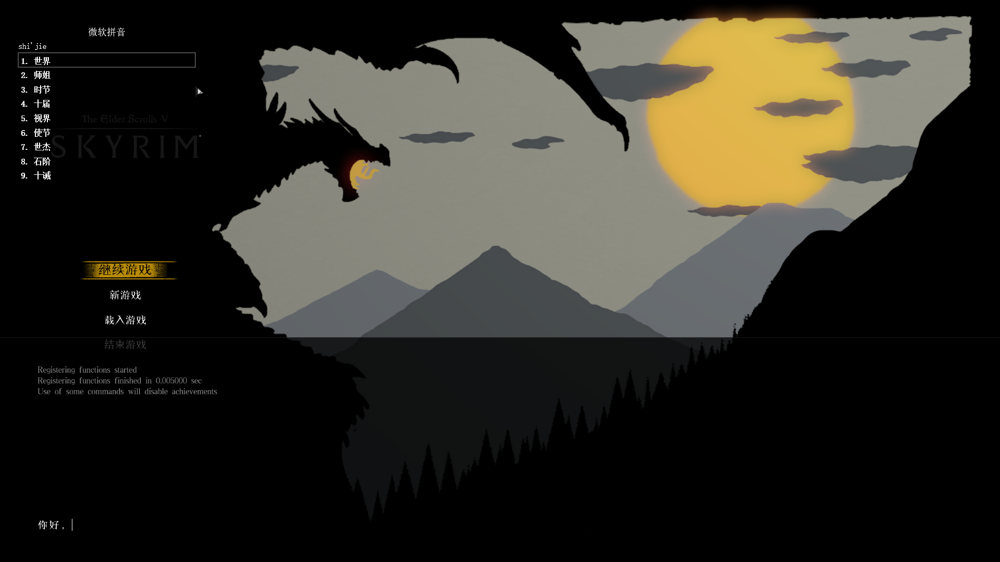
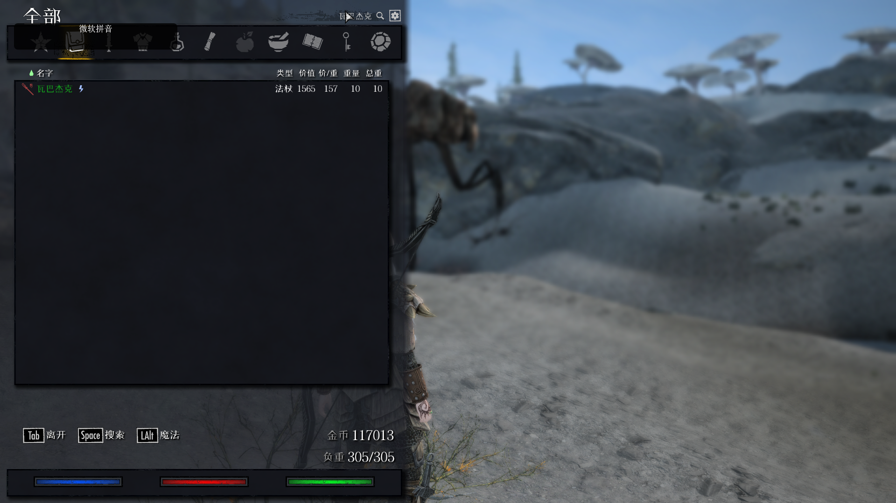
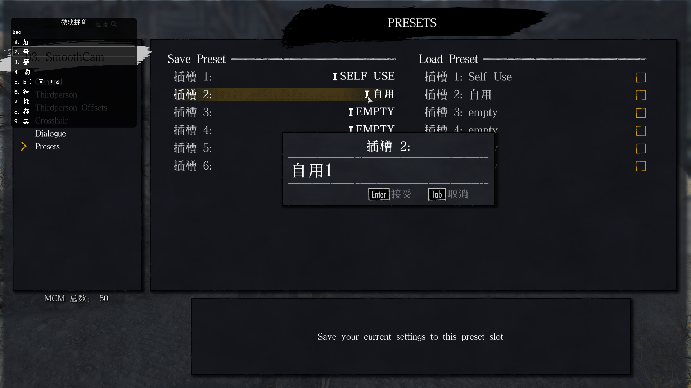
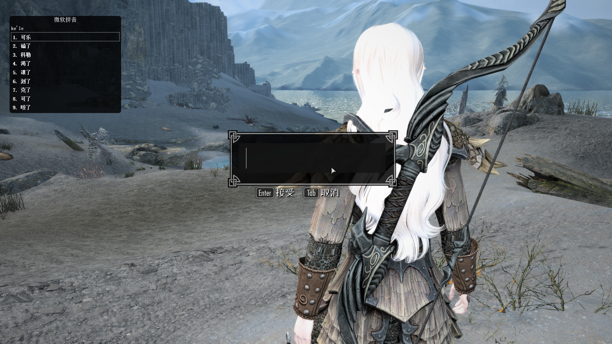

# SkyrimInputMethod

Enable Input Method and shows a panel in TESV:Skyrim Anniversary Edition (1.6.x)

## Features & Side effects

- Allow paste in any Input Area (Feature, Configurable `paste`, Default on)
- Unlock windows key (Feature, Configurable `unlock-win-key`, Default off)
- Make keyboard non exclusive(Side effect)

## End User Dependency

[Address Library](https://www.nexusmods.com/skyrimspecialedition/mods/32444)

## Build Requirements

[microsoft/vcpkg](https://github.com/microsoft/vcpkg)

[gottyduke/SKSEPlugins](https://github.com/gottyduke/SKSEPlugins)

[microsoft/Detours](https://github.com/microsoft/Detours)

## Credits

[kassent](https://github.com/kassent)/[ChineseInput](https://github.com/kassent/ChineseInput) - The original [LE](http://www.9damaogames.com/thread-2885-1-1.html) and [SE](http://www.9damaogames.com/forum.php?mod=viewthread&tid=193942) Mod

[gottyduke](https://github.com/gottyduke)/[SKSEPlugins](https://github.com/gottyduke/SKSEPlugins) - Mod Template

# 中文版

在上古卷轴V：天际 十周年版（1.6.640）中启用输入法并且绘制一个输入面板

## 功能 & 副作用

- 允许在任何输入区域粘贴（功能，可配置, 配置文件`paste`，默认开）
- 解锁 Windows 键（功能，可配置 `unlock-win-key`，默认关）
- 使键盘变成非独占模式（副作用）

## 使用依赖

[Address Library](https://www.nexusmods.com/skyrimspecialedition/mods/32444)

## 构建依赖

[microsoft/vcpkg](https://github.com/microsoft/vcpkg)

[gottyduke/SKSEPlugins](https://github.com/gottyduke/SKSEPlugins)

[CharmedBaryon/CommonLibSSE-NG](https://github.com/CharmedBaryon/CommonLibSSE-NG)

## 感谢

[kassent](https://github.com/kassent)/[ChineseInput](https://github.com/kassent/ChineseInput) - [传奇版](http://www.9damaogames.com/thread-2885-1-1.html) 和 [特别版](http://www.9damaogames.com/forum.php?mod=viewthread&tid=193942) 的中文输入Mod

[gottyduke](https://github.com/gottyduke)/[SKSEPlugins](https://github.com/gottyduke/SKSEPlugins) - 本Mod使用的模板 

## Previews

### Console

### Inventory

### MCM Dialog

### RaceMenu

